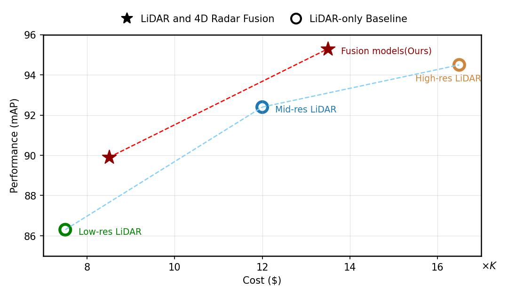
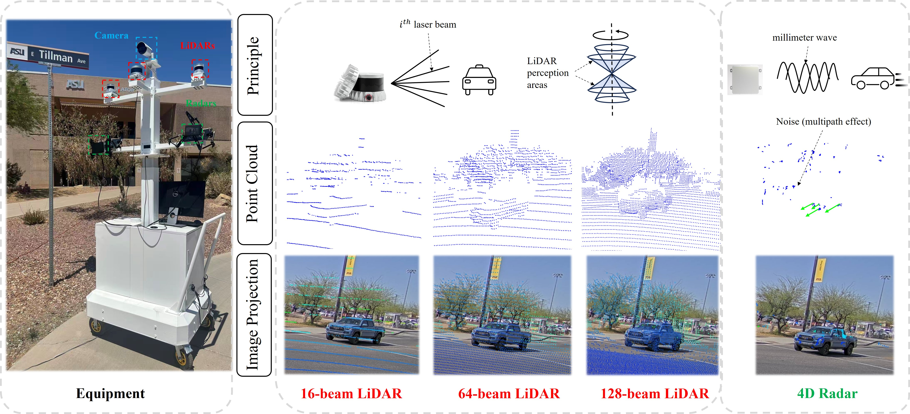

# On the Resolution–Performance Tradeoff in LiDAR and 4D Radar Fusion for Roadside Perception

This repo is the official implementation of our paper: On the Resolution–Performance Tradeoff in LiDAR and 4D Radar Fusion for Roadside Perception as well as the follow-ups. Our code is built upon the codebase of [OpenPCDet](https://github.com/open-mmlab/OpenPCDet).

<p>
  
  
</p>


## Overview
- [🤔 Introduction](#introduction)
- [🏆 Main Results](#main-results)
- [🚀 Quick Start](#quick-start)


## Introduction
Through systematic model architecture exploration, this paper demonstrates that fusing information-rich 4D mmWave radar with low-resolution LiDAR point clouds can enrich learned feature representations and outperform a high-resolution LiDAR-only baseline in detecting diverse traffic participants. Through extensive ablation studies and experimental evaluation, we demonstrate that the optimal proposed fusion model integrating 4D radar with low-resolution LiDAR achieves object detection accuracy close to a mid-resolution LiDAR-only solution. Furthermore, the fusion of 4D radar and mid-resolution LiDAR even outperforms the solution using high-resolution LiDAR only by `+0.8%`. 
<div align="center">
  
</div>

We construct a multi-modal, multi-resolution roadside perception dataset in the [CARLA](https://github.com/carla-simulator/carla) simulation environment. To the best of our knowledge, this dataset is the first large-scale roadside perception benchmark dataset combining multi-resolution and multimodal sensors, enabling fair and controlled comparisons of various multimodal fusion strategies.
<div align="center">
  
</div>

What's more, to improve the fidelity of the simulation platform in capturing the distribution of point-cloud data from traffic participants, particularly for mmWave radar sensing, we develop a lightweight multimodal roadside sensing platform and deploy it on a private roadway to collect real-world multimodal data. These realistic measurements are used to fine-tune the radar module within the simulation environment, while maintaining sensor configurations identical to those used on the physical platform.
<div align="center">
  
</div>

## Main Results
### 3D Object Detection
We run training 5 times and report average metrics across all results. Notably, we release training configuration files and trained weight files for all fusion paradigms.
#### LiDAR-only Baseline
|  Model  |  mAP ↑ | Latency ↓ | Memory ↓ |
|---------|------|---------|--------|
|  [Low-resolution LiDAR](tools/cfgs/carla_models/lion_lidar.yaml) |  86.3  |  2.1ms  | 17.6MB |
|  [Mid-resolution LiDAR](tools/cfgs/carla_models/lion_lidar.yaml)    |  92.4  |  2.2ms  | 42.3MB | 
|  [High-resolution LiDAR](tools/cfgs/carla_models/lion_lidar.yaml)   |  94.5  |  2.9ms  | 98.7MB |


#### Voxel-level Early Fusion
<table cellpadding="0" cellspacing="0" style="width:100%; border-collapse:collapse;">
  <tr>
    <td valign="top" style="width:50%; padding-right:16px;">
      <b>Low-resolution LiDAR + 4D Radar</b><br/>
      <table cellpadding="6" cellspacing="0" style="width:100%; border-collapse:collapse;">
        <tr>
          <th align="left">Fusion Type</th>
          <th align="right">mAP ↑</th>
          <th align="right">Latency ↓</th>
          <th align="right">Memory ↓</th>
        </tr>
        <tr><td><a href="tools/cfgs/carla_models/vv_conv_fusion.yaml">No Early Fusion</a></td><td align="right">88.2</td><td align="right">2.1ms</td><td align="right">39.5MB</td></tr>
        <tr><td>Unidirectional</td><td align="right">89.0</td><td align="right">4.3ms</td><td align="right">63.7MB</td></tr>
        <tr><td>Bidirectional</td><td align="right">89.9</td><td align="right">6.3ms</td><td align="right">81.8MB</td></tr>
      </table>
    </td>
    <td valign="top" style="width:50%; padding-left:16px;">
      <b>Mid-resolution LiDAR + 4D Radar</b><br/>
      <table cellpadding="6" cellspacing="0" style="width:100%; border-collapse:collapse;">
        <tr>
          <th align="left">Fusion Type</th>
          <th align="right">mAP ↑</th>
          <th align="right">Latency ↓</th>
          <th align="right">Memory ↓</th>
        </tr>
        <tr><td><a href="tools/cfgs/carla_models/ll_msattn_bi_query.yaml">No Early Fusion</a></td><td align="right">95.3</td><td align="right">2.3ms</td><td align="right">56.5MB</td></tr>
        <tr><td>Unidirectional</td><td align="right">95.4</td><td align="right">4.5ms</td><td align="right">87.6MB</td></tr>
        <tr><td>Bidirectional</td><td align="right">95.6</td><td align="right">6.6ms</td><td align="right">113.9MB</td></tr>
      </table>
    </td>
  </tr>
</table>

#### Single Modality Backbones
<table cellpadding="0" cellspacing="0" style="width:100%; border-collapse:collapse;">
  <tr>
    <td valign="top" style="width:50%; padding-right:16px;">
      <b>Low-resolution LiDAR + 4D Radar</b><br/>
      <table cellpadding="6" cellspacing="0" style="width:100%; border-collapse:collapse;">
        <tr>
          <th align="left">Backbone</th>
          <th align="right">mAP ↑</th>
          <th align="right">Latency ↓</th>
          <th align="right">Memory ↓</th>
        </tr>
        <tr><td><a href="tools/cfgs/carla_models/vv_msattn_bi_query.yaml">Sparse convolution</a></td><td align="right">89.9</td><td align="right">15.3ms</td><td align="right">50.49MB</td></tr>
        <tr><td><a href="tools/cfgs/carla_models/dd_msattn_bi_query.yaml">Transformer</a></td><td align="right">89.5</td><td align="right">29.3ms</td><td align="right">258.7MB</td></tr>
        <tr><td><a href="tools/cfgs/carla_models/ll_msattn_bi_query.yaml">Linear RNN</a></td><td align="right">90.4</td><td align="right">73.8ms</td><td align="right">197.2MB</td></tr>
      </table>
    </td>
    <td valign="top" style="width:50%; padding-left:16px;">
      <b>Mid-resolution LiDAR + 4D Radar</b><br/>
      <table cellpadding="6" cellspacing="0" style="width:100%; border-collapse:collapse;">
        <tr>
          <th align="left">Backbone</th>
          <th align="right">mAP ↑</th>
          <th align="right">Latency ↓</th>
          <th align="right">Memory ↓</th>
        </tr>
        <tr><td><a href="tools/cfgs/carla_models/vv_msattn_bi_query.yaml">Sparse convolution</a></td><td align="right">94.1</td><td align="right">20.1ms</td><td align="right">86.8MB</td></tr>
        <tr><td><a href="tools/cfgs/carla_models/dd_msattn_bi_query.yaml">Transformer</a></td><td align="right">94.6</td><td align="right">45.2ms</td><td align="right">552.4MB</td></tr>
        <tr><td><a href="tools/cfgs/carla_models/ll_msattn_bi_query.yaml">Linear RNN</a></td><td align="right">95.3</td><td align="right">99.3ms</td><td align="right">417.5MB</td></tr>
      </table>
    </td>
  </tr>
</table>

#### Multi-modality Middle Fusion
<table cellpadding="0" cellspacing="0" style="width:100%; border-collapse:collapse;">
  <tr>
    <td valign="top" style="width:50%; padding-right:16px;">
      <b>Low-resolution LiDAR + 4D Radar</b><br/>
      <table cellpadding="6" cellspacing="0" style="width:100%; border-collapse:collapse;">
        <tr>
          <th align="left">Fusion Type</th>
          <th align="right">mAP ↑</th>
          <th align="right">Latency ↓</th>
          <th align="right">Memory ↓</th>
        </tr>
        <tr>
          <td><a href="tools/cfgs/carla_models/vv_conv_fusion.yaml">Fully-convolutional Fusion</a></td>
          <td align="right">89.9</td>
          <td align="right">1.3ms</td>
          <td align="right">214.0MB</td>
        </tr>
        <tr>
          <td><a href="tools/cfgs/carla_models/vv_gated_fusion.yaml">Adaptive Gated Network</a></td>
          <td align="right">89.3</td>
          <td align="right">8.8ms</td>
          <td align="right">215.5MB</td>
        </tr>
        <tr>
          <td><a href="tools/cfgs/carla_models/vv_msattn_bi_query.yaml">Deformable Transformer-based</a></td>
          <td align="right">90.2</td>
          <td align="right">6.1ms</td>
          <td align="right">224.8MB</td>
        </tr>
      </table>
    </td>
    <td valign="top" style="width:50%; padding-left:16px;">
      <b>Mid-resolution LiDAR + 4D Radar</b><br/>
      <table cellpadding="6" cellspacing="0" style="width:100%; border-collapse:collapse;">
        <tr>
          <th align="left">Fusion Type</th>
          <th align="right">mAP ↑</th>
          <th align="right">Latency ↓</th>
          <th align="right">Memory ↓</th>
        </tr>
        <tr>
          <td><a href="tools/cfgs/carla_models/ll_conv_fusion.yaml">Fully-convolutional Fusion</a></td>
          <td align="right">94.0</td>
          <td align="right">1.4ms</td>
          <td align="right">214.0MB</td>
        </tr>
        <tr>
          <td><a href="tools/cfgs/carla_models/ll_gated_fusion.yaml">Adaptive Gated Network</a></td>
          <td align="right">94.7</td>
          <td align="right">9.8ms</td>
          <td align="right">215.5MB</td>
        </tr>
        <tr>
          <td><a href="tools/cfgs/carla_models/ll_msattn_bi_query.yaml">Deformable Transformer-based</a></td>
          <td align="right">95.3</td>
          <td align="right">8.5ms</td>
          <td align="right">224.8MB</td>
        </tr>
      </table>
    </td>
  </tr>
</table>

#### Query Direction
<table cellpadding="0" cellspacing="0" style="width:100%; border-collapse:collapse;">
  <tr>
    <td valign="top" style="width:50%; padding-right:16px;">
      <b>Low-resolution LiDAR + 4D Radar</b><br/>
      <table cellpadding="6" cellspacing="0" style="width:100%; border-collapse:collapse; table-layout:fixed;">
        <colgroup>
          <col style="width:58%;">
          <col style="width:14%;">
          <col style="width:14%;">
          <col style="width:14%;">
        </colgroup>
        <tr>
          <th align="left">Variant</th>
          <th align="right">mAP ↑</th>
          <th align="right">Latency ↓</th>
          <th align="right">Memory ↓</th>
        </tr>
        <tr>
          <td><a href="tools/cfgs/carla_models/vv_msattn_radar_query.yaml">Radar Query</a></td>
          <td align="right">89.7</td>
          <td align="right">5.5ms</td>
          <td align="right">223.0MB</td>
        </tr>
        <tr>
          <td><a href="tools/cfgs/carla_models/vv_msattn_lidar_query.yaml">LiDAR Query</a></td>
          <td align="right">90.0</td>
          <td align="right">5.8ms</td>
          <td align="right">222.5MB</td>
        </tr>
        <tr>
          <td><a href="tools/cfgs/carla_models/vv_msattn_bi_query.yaml">Bidirectional</a></td>
          <td align="right">90.2</td>
          <td align="right">6.1ms</td>
          <td align="right">224.8MB</td>
        </tr>
      </table>
    </td>
    <td valign="top" style="width:50%; padding-left:16px;">
      <b>Mid-resolution LiDAR + 4D Radar</b><br/>
      <table cellpadding="6" cellspacing="0" style="width:100%; border-collapse:collapse; table-layout:fixed;">
        <colgroup>
          <col style="width:58%;">
          <col style="width:14%;">
          <col style="width:14%;">
          <col style="width:14%;">
        </colgroup>
        <tr>
          <th align="left">Variant</th>
          <th align="right">mAP ↑</th>
          <th align="right">Latency ↓</th>
          <th align="right">Memory ↓</th>
        </tr>
        <tr>
          <td><a href="tools/cfgs/carla_models/ll_msattn_radar_query.yaml">Radar Query</a></td>
          <td align="right">94.9</td>
          <td align="right">7.8ms</td>
          <td align="right">223.0MB</td>
        </tr>
        <tr>
          <td><a href="tools/cfgs/carla_models/ll_msattn_lidar_query.yaml">LiDAR Query</a></td>
          <td align="right">95.2</td>
          <td align="right">8.3ms</td>
          <td align="right">222.5MB</td>
        </tr>
        <tr>
          <td><a href="tools/cfgs/carla_models/ll_msattn_bi_query.yaml">Bidirectional</a></td>
          <td align="right">95.3</td>
          <td align="right">8.5ms</td>
          <td align="right">224.8MB</td>
        </tr>
      </table>
    </td>
  </tr>
</table>


## Quick Start
### Requirements
All the codes are tested in the following environment:
* Ubuntu 22.04
* Python 3.8.20
* PyTorch 2.1.2
* CUDA 12.1
* [`spconv v2.x`](https://github.com/traveller59/spconv)


### Installation
Please follow [OpenPCDet's official instructions](https://github.com/open-mmlab/OpenPCDet/blob/master/docs/INSTALL.md) to set up the environment first.

### Dataset Preparation
* Please download our multimodal, multi-resolution dataset, which is divided into three subsets based on resolution: [low-resolution dataset](https://www.dropbox.com/scl/fi/71p8cnrgohstvcxk8g7o9/low_lidar_2radar.zip?rlkey=j9jc8pdln9mzie0mvaawdc52i&st=3odmdk4p&dl=0), [medium-resolution dataset](https://www.dropbox.com/scl/fi/jddck41d8ukkzng2f6r3y/mid_lidar_2radar.zip?rlkey=38k5p5pqrhkvssfdktobd1xro&st=c1oq00au&dl=0), and [high-resolution dataset](https://www.dropbox.com/scl/fi/2gxxdz31tfajhcp6a0nky/high_lidar_2radar.zip?rlkey=svy4zmg2onjir4g4gojyu87qm&st=wmigap1a&dl=0).

* After extracting the files, please organize the downloaded files as follows:
```
OpenPCDet
├── data
│   ├── low_lidar_2radar
│   │   │── v1.0-trainval
│   │   │   │── lidar_fusion
│   │   │   │── radar_fusion
│   │   │   │── label
│   │   │   │── image
│   │   │   │── calib
│   │   │   │── lidar
│   │   │   │── radar
│   │   │   │── trainset.txt
│   │   │   │── valset.txt
│   ├── mid_lidar_2radar
│   │   │── v1.0-trainval
│   │   │   │── ......
│   ├── high_lidar_2radar
│   │   │── v1.0-trainval
│   │   │   │── ......
├── pcdet
├── tools
```

* Run the following command to generate data information. To generate information for the three different resolution datasets, please modify `data_path` to the path of the corresponding dataset and execute the command separately:

```python 
# For example, create train and val info file of low-resolution dataset
python create_carla_dataset.py --data_path /data/low_lidar_2radar/v1.0-trainval --mode train
python create_carla_dataset.py --data_path /data/low_lidar_2radar/v1.0-trainval --mode val
``` 

* The final format of the generated data is as follows:
```
OpenPCDet
├── data
│   ├── low_lidar_2radar
│   │   │── v1.0-trainval
│   │   │   │── lidar_fusion
│   │   │   │── radar_fusion
│   │   │   │── label
│   │   │   │── image
│   │   │   │── calib
│   │   │   │── lidar
│   │   │   │── radar
│   │   │   │── trainset.txt
│   │   │   │── valset.txt
│   │   │   │── carla_gt_database
│   │   │   │── carla_dbinfos_train.pkl
│   │   │   │── carla_infos_train.pkl
│   ├── mid_lidar_2radar
│   │   │── v1.0-trainval
│   │   │   │── ......
│   ├── high_lidar_2radar
│   │   │── v1.0-trainval
│   │   │   │── ......
├── pcdet
├── tools
```

### Training
The configuration files required for training are located in `/tools/cfgs/carla_models`. Before starting training, please ensure that the DATA_PATH field in `/tools/cfgs/dataset_configs/carla_dataset.yaml` is set to the correct dataset directory corresponding to the resolution you intend to train.

To train our final fusion model for low-resolution LiDAR and 4D radar:
```shell
# multi-gpu training
cd tools
sh scripts/dist_train.sh 4 --cfg_file ./cfgs/carla_models/vv_transhead.yaml
```

To train our final fusion model for mid-resolution LiDAR and 4D radar:
```shell
# multi-gpu training
cd tools
sh scripts/dist_train.sh 4 --cfg_file ./cfgs/carla_models/ll_msattn.yaml
```


